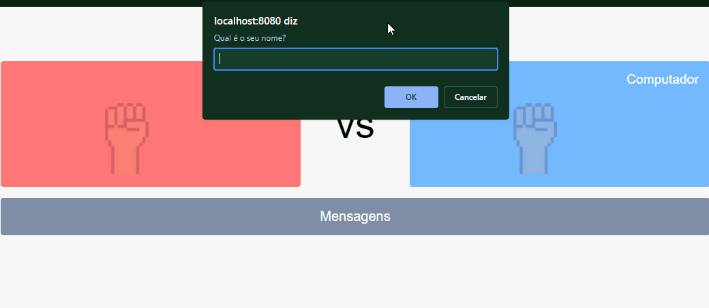
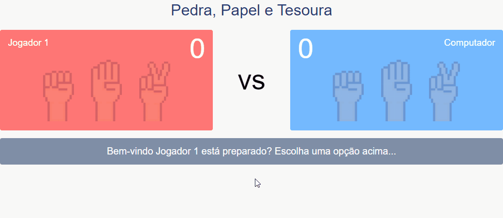
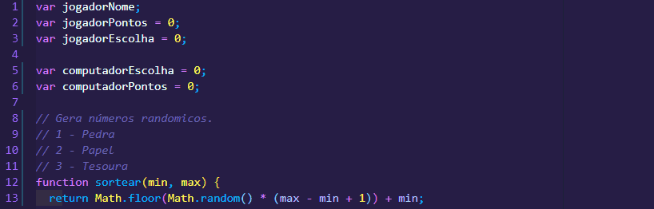
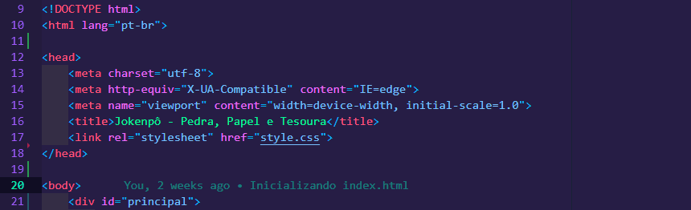

# <strong><p align="center">README</p></strong>

<p align="center">Esse projeto tem como foco em fazer um jogo jokenpô, é um jogo de mãos recreativo e simples para você jogar contra o computador. O jogo é frequentemente empregado como método de seleção, assim como lançar moedas, jogar dados, entre outros.</p>

<br>

<h1 align="center">Tabela de conteúdo</h1>
<p align="center">
<a href="#sobre">Sobre</a> -
<a href="#roadmap">Roadmap</a> -
<a href="#tecnologias">Tecnologias</a> -
<a href="#pré-requisitos">Pré Requisitos</a>
</p>

# <h2>Sobre</h2>
<p>O jogo é conhecido em vários lugares do mundo, e é acompanhado de "gritos" ou rimas diferentes: Nos países lusófonos, os jogadores geralmente dizem "Pedra, Papel, Tesoura" antes de jogar. Em algumas regiões do Brasil usa-se "Janken-pon" devido à influência de imigrantes japoneses, sendo que pedra, papel e tesoura não é o nome usual do jogo em São Paulo.<br><h3>Regras do jogo:</h3> Pedra ganha da tesoura (amassando-a ou quebrando-a).<br>Tesoura ganha do papel (cortando-o).<br>Papel ganha da pedra (embrulhando-a).</p>

<br>

# <h2>Roadmap</h2>
<h1>
  
  
  
  
</h1>
<br>

# <h2>🦾👾 Tecnologias</h2>

<p>As seguintes ferramentas foram usadas na construção do projeto:</p>

- [HTML](https://developer.mozilla.org/pt-BR/docs/Web/HTML)
- [CSS](https://developer.mozilla.org/pt-BR/docs/Web/CSS)
- [JAVASCRIPT](https://developer.mozilla.org/pt-BR/docs/Web/JavaScript)

<br>

# <h2>Pré-requisitos</h2>

Antes de começar, você vai precisar ter instalado em sua máquina as seguintes ferramentas: [GIT](https://git-scm.com/downloads), [NODE.JS](https://nodejs.org/en/download/). Além disto é bom ter um editor para trabalhar ou visualizar o código como [VSCODE](https://code.visualstudio.com/download).

### 🤖 Rodando o Front End

```bash
## Clone este repositório
$ git clone https://github.com/RodrigoSilva95/Jokenpo

## Acesse a pasta do projeto no terminal/cmd
$ cd Jokenpo

## Inicialize a sua IDE de preferência VSCODE.
$ code .

## Execute a aplicação em modo desenvolvimento e abra o index.html
$ CTRL + SHIFT + V

## O servidor iniciará na porta: 8080 - acesse <https://localhost:8080>
$ Por fim, execute e teste aplicação.
```
<hr>
<br>

😁👍 [Siga-me no LinkedIn](https://www.linkedin.com/in/rodrigo-de-lima-santos-silva/)
